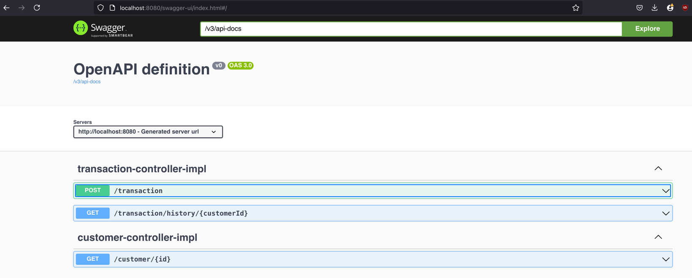
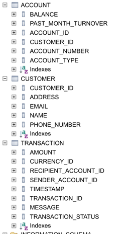
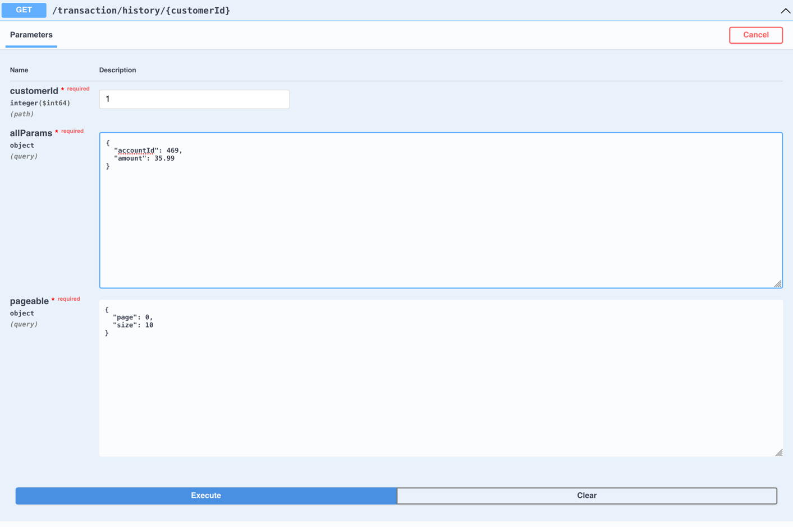

# Starting the application

```console
mvn clean install
mvn exec:java -Dexec.mainClass="com.project.leapwise.data_generation.DataGenerator"
mvn spring-boot:run
```

Second command is to generate input data so you can run it only once.

The application should be up and running now on http://localhost:8080/ and the swagger-ui should be available
on http://localhost:8080/swagger-ui/index.html



# Decisions I made along the way

## DB

I mainly used what was in example. Just added TransactionStatus to transaction.


## Data import

After some consideration and reading some posts i decided to multithread object mapping and saving to db but not file
reading because i read that multithreaded file reading should be only done on highly specialized high throughput
computers and not on home laptops becouse in most cases bottleneck is speed of I/O operations and not processor speed
and multithreading can not do anything to help that.

## Transaction history filtering

I could have writen jpql named query with something like this

```sql
select transaction
from Transaction transaction
         join Account senderAccount on transaction.senderAccountId = senderAccount.accountId
         join Account recipientAccount on transaction.recipientAccountId = recipientAccount.accountId
where senderAccount.customerId = :customerId
   or recipientAccount.customerId = :customerIdand
    and COALESCE(:currencyId, transaction.currencyId) = transaction.currencyId
    ... (all other filters)
```

But that would mean that on addition or change of property code would have to get added or changed in 3 or 4 places. So
I decided to
go with this option because it is easier to understand and maintain, but it can get changed in future if there are any
memory or response time issues.


You can set filtering properties like this in swagger. Make sure either to delete sort from pageable or do something
like this:

```
{
  "page": 0,
  "size": 10,
  "sort": [
    "amount,ASC"
  ]
}
```

## Mail sending

I made mail sender work with my private email there are properties in application.yml

    username: XXXX@gmail.com
    password: XXXX 

which you need to fill out first to make it work if you want I can send them to you through email. Btw it is not
ordinary password it is [gmail app password](https://support.google.com/mail/answer/185833?hl=en).
